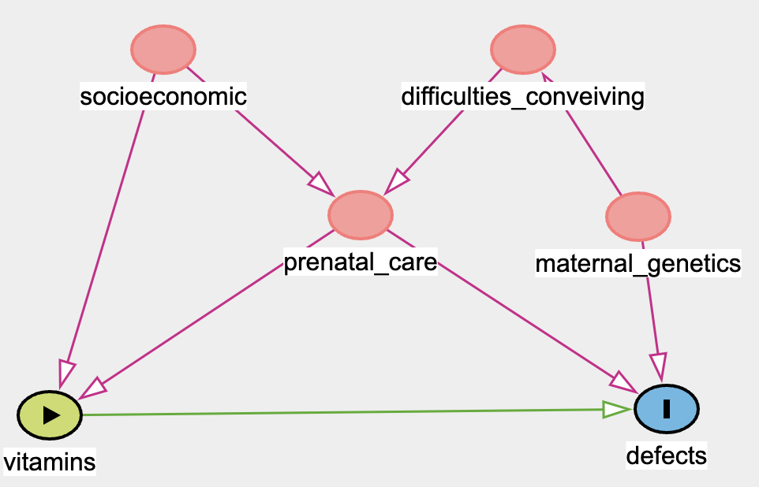

# DAGs and adjustment sets

1. Please think of a causal hypothesis that you might use in your own work. If you don't have an example in mind, consider the effect of material vitamins during pregnancy on birth defects that is outlined below.

2. Write down all the variables you have measured, and also any other variables you think are of importance that you did not measure. 


3. Please write down the \textbf{estimand} in terms of counterfactuals for your own example or ours. 


4. Draw a DAG by hand, with pencil and paper. Consider what are confounders in your example. Do you have unmeasured confounding of your estimand given your DAG? 


5. Draw your DAG in Dagitty available at \url{https://www.dagitty.net/dags.html}. See if it agrees with you about the adjustment set or does Dagitty tell you your estimand cannot be estimated using your data? 

6. Now that you have an adjustment set, how would you use it? Think about how you might form an estimator for your estimand. 

# Example problem if you do not have your own
If you don't have your own data example, you can use the following example.

Consider an observational study investigating the causal effect of vitamin use during pregnancy (exposure) on the risk of birth defects (outcome). In addition you have observations on the mothers' socio-economic status at baseline, level of prenatal care, whether the woman had difficulties getting pregnant, and a representation of the mother's genetics.

1. Use this proposed setup to answer the questions above.

2. Consider the DAG shown at the end of this document. Find out what the minimal sufficient adjustment sets are for estimating the causal effect.

3. Assume that we know from subject matter considerations that the maternal genetics plays a role in the relationships as shown in the example, but we are unable to observe it because of the cost and difficulty in getting a genetic profile of the mothers thus making genetics a latent variable. How would this affect the adjustment sets.

4. Make an alteration to the DAG such that the maternal genetics also have an affect of the mother's willingness to take vitamins during pregnancy. How would that alter the estimation and identification of the causal effect in both the case there the genetics are observed and when they are unobserved.

```{r, include=TRUE, fig.align="center", echo=FALSE}

```